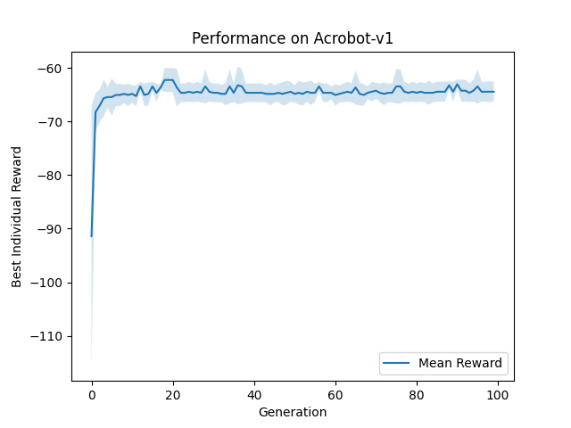

# Neuroevolution with Gymnasium Environments

This project applies a basic neuroevolution strategy to solve reinforcement learning tasks using Gymnasium environments. The solution includes evaluation over multiple random seeds, performance logging, and result visualization.

---

## Environments Tried

* `Acrobot-v1` (Classic Control)
* `Pendulum-v1` (Classic Control)

---

## Algorithm Description

I use a genetic algorithm to adjust the weights of a fixed neural network. Each genome represents the network's weights and biases, and individuals are tested in a simulated environment.

### Neural Network Architecture

| Environment | Architecture        |
| ----------- | ------------------- |
| Acrobot-v1  | \[6] → \[16] → \[3] |
| Pendulum-v1 | \[3] → \[32] → \[1] |

### Key Features

* ReLU activation in hidden layers, softmax (Acrobot) or tanh (Pendulum) in output.
* Fitness = average return over 3 episodes.
* Discrete (Acrobot) or continuous (Pendulum) action space support.

### Genetic Algorithm Settings

| Parameter         | Acrobot-v1 | Pendulum-v1 |
| ----------------- | ---------- | ----------- |
| Population Size   | 80         | 60          |
| Generations       | 100        | 150         |
| Hidden Layer Size | 16         | 32          |
| Mutation Rate     | 0.05       | 0.10        |
| Mutation Strength | 0.10       | 0.20        |
| Elitism Fraction  | 5%         | 5%          |
| Episodes/Eval     | 3          | 3           |
| Seeds (for avg)   | 5          | 5           |

---

## How to Run

### 1. Install dependencies

```
pip install -r requirements.txt
```

### 2. Train on Acrobot

```
python main.py --env Acrobot-v1
```

### 3. Train on Pendulum

```
python main.py --env Pendulum-v1
```

Each run will:

* Evolve networks across 5 seeds.
* Log progress to `results/log_<env>.txt`.
* Save a performance plot to `results/<env>_performance.png`.

---

## Output Example

Each experiment produces a graph that shows the average performance over generations, with a shaded region for standard deviation. Example:



---

## 📂 Files

* `main.py`: Full training + evaluation script.
* `requirements.txt`: Dependencies.
* `results/`: Logs and plots.

